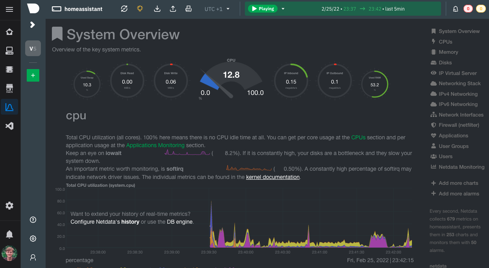

<h3 align="center">Netdata is high-fidelity infrastructure monitoring and troubleshooting. Open-source, free, preconfigured, opinionated, and always real-time.</h3>
 

Netdata's **distributed, real-time monitoring Agent** collects thousands of metrics from systems, hardware, containers,
and applications with zero configuration. It runs permanently on all your physical/virtual servers, containers, cloud
deployments, and edge/IoT devices, and is perfectly safe to install on your systems mid-incident without any
preparation.

For more information you can visit the [official website](https://netdata.cloud) or the [documentation](https://docs.netdata.cloud) or the [Github page](https://github.com/netdata/netdata/blob/master/README.md).

# License
Netdata is licensed under the GNU General Public License v3.0

[Netdata License](https://github.com/netdata/netdata/blob/master/LICENSE)
# Homeassistant integration

This homeassistant add-on is an integration of Netdata.
Here is an example of a Netdata dashboard:

)

[aarch64-shield]: https://img.shields.io/badge/aarch64-yes-green.svg
[amd64-shield]: https://img.shields.io/badge/amd64-yes-green.svg
[armhf-shield]: https://img.shields.io/badge/armhf-yes-green.svg
[armv7-shield]: https://img.shields.io/badge/armv7-yes-green.svg
[i386-shield]: https://img.shields.io/badge/i386-yes-green.svg
